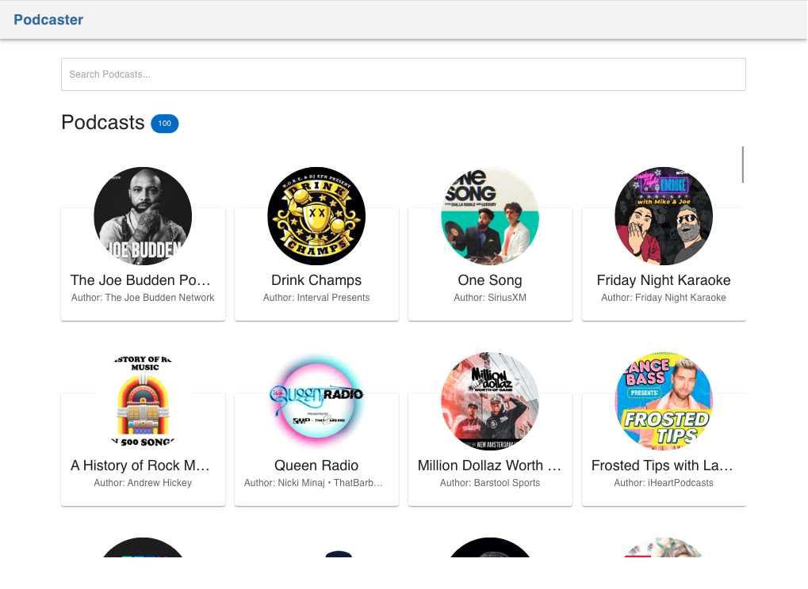

# Ecommerce with NextJS

<div>
  <p align="center">
    
  </p>
</div>

## Overview

In the image, we can see the expected result of the app when it is correctly installed. The image showcases the user interface of the app, displaying various components and interactions.

## Getting Started

### Prerequisites

- npm

### Installation

1. Clone the repository:

   ```sh
     git clone git@github.com:JoaquinBuxo/podcasts-react.git
   ```

2. Install dependencies:

- podcasts : `cd podcasts-react`

  ```sh
  npm install
  ```

3. Setup and start the app:

   ```sh
   npm run dev
   ```

4. Run unit tests:

   ```sh
   npm run test
   ```

Open [http://localhost:5173](http://localhost:5173) with your browser to see the result.
